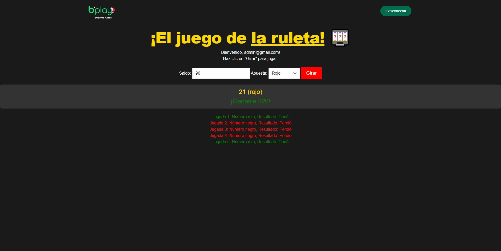

# El juego de la Ruleta

Simulador de la ruleta con números del 0 al 36, con saldo y elegir a que color apostar. Tambien incluye login e historial de jugadas. Esta página fue hecha con JavaScript Vanilla, Tailwind y Flowbite.

Para empezar a jugar solamente se tiene que registrar con "admin@gmail.com" y "admin". Los usuarios se obtienen del archivos datos.json. 

## Requisitos de la Entrega

Cumplí con todos los conceptos tecnicos en JavaScript que se requerían en la entrega del proyecto:

- ✓ Objetos y Arrays. Métodos de Arrays
- ✓ Funciones y condicionales.
- ✓ Generación del DOM de forma dinámica. 
- ✓ Sintaxis avanzada.
- ✓ Uso de Librería
- ✓ Carga de datos desde un JSON local

## Instalación local

1. Clonar el repositorio con 

``git clone https://github.com/tquintana1/PreEntrega1Delaquintana.git``

2. Abrir el Visual Studio Code y asegurarse de tener instalado la extensión llamada [Live Server](https://marketplace.visualstudio.com/items?itemName=ritwickdey.LiveServer).

3. Abrir el HTML con Live Server

4. Loguearse con el mail "admin@gmail.com" y "admin". Despues pueden añadir más usuarios en datos.json

## Screenshots

## Autor 

- Thiago de la Quintana

## Licencia

Este proyecto está bajo la licencia "Juegos Malumeta".

---

© 2023 Thiago de la Quintana